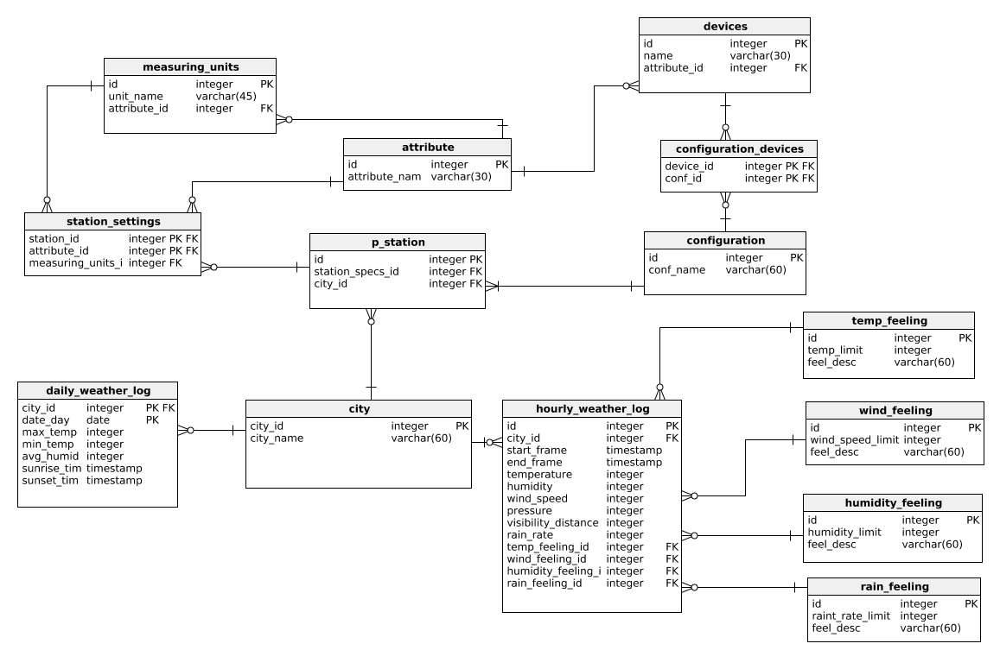

# WeatherStationSQL
## Potential app description:
* Report hourly details (temperature, humudity, wind speed, visibility, rain rate etc).
* Report current weather condition (sunny, windy, hot etc).
* Collect a forecast for each day in the next week ( max,min-temperature,average humidity,
approximate sunrise and sunset time)
* Allow user (sysadmin) to set local city, change station settings (changing unit for any attribute).
* Allow user (sysadmin) to see using which devices the measurements have been conducted.
* Allow user (sysadmin) to see the configuration of the station
## Entity Relationship Diagram - ERD

### Relationships
1. In one ***City*** a lot of ***stations*** can be located. **(Many)**
 One specific ***Station*** is located in one city. **(1)**
2. One ***Station*** has one unique ***configuration***. **(1)**
 One unique ***configuration*** can be installed in many different ***stations***. **(Many)**
3. Since One ***unique configuration*** consist of ***many devices***, and ***one device*** can be included in a ***lot of
configurations***. **(Many:Many)**, ***linked table (configuration_devices) have been created in order to handle
M:M relationship.***
4. One ***attribute*** can be measured by several ***devices*** **(1:Many)**, and one ***attribute*** may have several ***units.***
**(1:Many)**
5. Since ***one station*** can hold a ***lot of attributes***, and ***one attribute*** can be stored in a ***lot of stations***
**(Many:Many)**, ***linked table (station_settings) have been created.***
6. For ***one city*** a ***lot of “Daily measurements” will be recorded***, ***single “Daily measurement”*** will come from
one and only one city. **(1:Many)**
###### Note: Since this table holds one record per city per date, these columns (city_id and date_day ) form the
###### composite primary key for this table.
7. For ***one city*** a ***lot of “Hourly measurements”*** will be recorded, ***single “Hourly measurement”*** will come
from one and only one city. (1:Many)
8. each qualitative table ***(temp, wind, humidity, rain_feeling)*** can be referenced to several hours.

## Quantitative Entities:

###### Hourly_weather_log holds all attributes that change during the day. We consider these
###### attributes as one record for a specific timeframe.
* Id -> identifier of the Entity.
* city_id -> relevant city identifier.
* start_frame -> signifies when certain timeframe started.
* end_frame -> signifies when certain timeframe ended.
* temperature -> The current temperature for the timeframe.
* humidity -> The current humidity for the timeframe.
* wind_speed -> The current wind speed for the timeframe.
* pressure -> The current atmospheric pressure for the timeframe.
* visibility_distance -> range of visible distance for the timeframe.
* rain_rate -> The current rain rate for the timeframe.
* temp_feeling_id, wind_feeling_id, humidity_feeling_id, rain_feeling_id -> each of these attributes
indicates the overall weather status for the timeframe.

###### Daily_weather_log holds daily attributes
* city_id -> references the city table and indicates to which city this data corresponds.
* date_day -> calendar date for this information.
* max_temp -> maximum temperature during the whole day.
* min_temp -> minumim temperature during the whole day.
* avg_humidity -> average humidity in the air that day.
* sunrise_time -> stores the sunrise time.
* sunset_time -> stores the sunset time.

## Qualitative Entities:
###### Temp_feeling
* id -> identifier of the Entity.
* temp_limit -> example: if current_temperature(30) <= temp_limit(40) then description(hot)
* feel_desc -> description of the weather status. (hot,warm… etc)
###### Wind_feeling
* id -> identifier of the Entity.
* wind_speed_limit -> example: if wind_speed (30) <= wind_speed_limit (40) then description(Windy)
* Feel_desc -> descriprion of the wind status (windy,light wind, windless… etc)
###### Humidity_feeling
* Id -> identifier of the Entity.
* humidity_limit
* Feel_desc -> descriprion of the humidity status. (humid, low humidity… etc)
###### Rain_feeling
* Id -> identifier of the Entity.
* rain_rate_limit
* feel_desc -> descriprion of the rain status. (rainless, heave rain.. etc)
